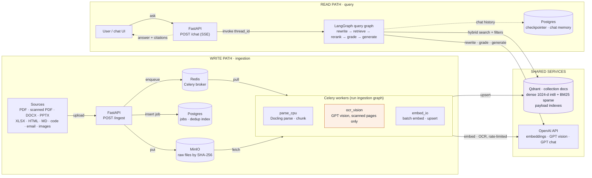
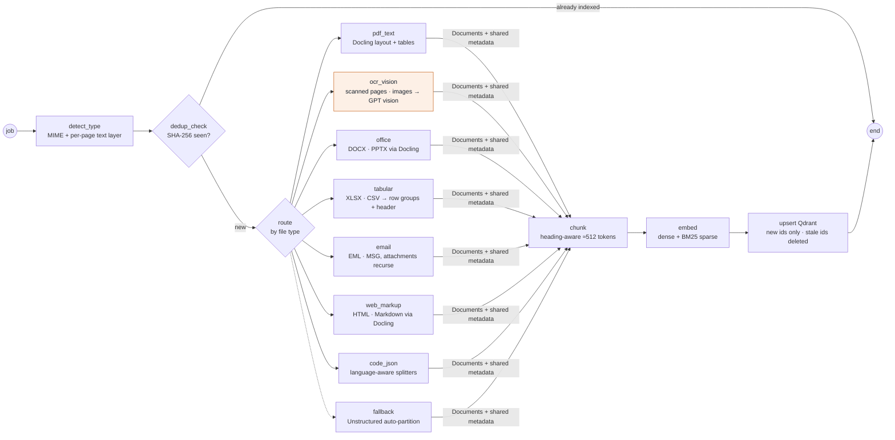
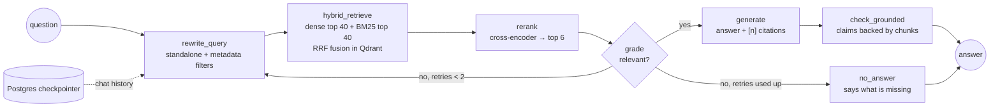

# Production RAG Platform — LangChain + LangGraph + Qdrant (10K docs/day)

## Context

**Current directory scan** (`Desktop/AI Learning/Node js Assistant`): no code or git repo yet. It holds 3 PDFs, which will be the first corpus and test set:

| File | Size | Nature | Parsing need |
|---|---|---|---|
| `NodeJSNotesForProfessionals.pdf` | 2.9 MB | Digital text, ~279 page objects, 59 images | Layout-aware text extraction, code blocks |
| `PDF-Guide-Node-Andrew-Mead-v3.pdf` | 2.5 MB | Digital text, ~125 page objects | Layout-aware text extraction |
| `nodejs handwritten notes.pdf` | 33.7 MB | **Scanned/handwritten** (87 images, almost no fonts) | **Vision-LLM OCR** (Tesseract handles handwriting poorly) |

**Tooling available:** Python 3.11.4, Node 22, Docker 27.

**Goal:** a RAG system that ingests **about 10K documents/day** across mixed formats (text and scanned PDFs, DOCX/PPTX/XLSX/CSV, HTML/MD/JSON/code, images, emails, others) and answers questions with citations.
**Decisions made:** Python, OpenAI (LLM + embeddings), local Docker Compose first, cloud-ready later.

**Build status (2026-09-29):** all phases implemented plus production hardening: API-key auth with tenant isolation, per-key limits, daily caps and shared Azure rate limits, async chat with answer cache (40–59 answers/s per process at 100 concurrent users, fake models), Alembic migrations, metrics and JSON logs, backups, Azure Blob, Docker, AKS manifests with KEDA, CI. 63 tests. Not yet done: real Azure chat/vision runs and a first AKS deployment. See README → Production readiness.

**Changes made during Phase 1:**
- **MinIO replaced by a blob store interface** (`src/rag/storage/blob.py`). MinIO no longer publishes community Docker images. Raw files are stored content-addressed in a local folder (`BLOB_BACKEND=local`) or in any S3-compatible bucket (`BLOB_BACKEND=s3`). Wherever the diagrams below say "MinIO", read "blob store".
- **Service URLs use `127.0.0.1`, not `localhost`.** On Windows, `localhost` tries IPv6 first, and each Postgres connection stalled for about 5 seconds.

---

## 1. Capacity analysis (drives every design choice)

These assumptions are a planning baseline. They will be re-measured on real data.

- 10K docs/day ≈ **420/hr ≈ 7/min on average**. Size for a **5× peak (about 35 docs/min)**.
- Assume 15 pages/doc on average → **about 150K pages/day**. At about 3 chunks/page → **about 450K chunks/day ≈ 165M chunks/year**.
- **Embedding volume:** 450K × ~400 tokens ≈ **180M tokens/day**. `text-embedding-3-small` costs a few $/day. `-large` costs about 6× more. Verify current OpenAI pricing. The **Batch API (about 50% cheaper)** can be used for non-urgent backfills.
- **Rate limits:** 180M tokens/day ≈ 125K tokens/min on average. This needs batching (up to 2048 inputs per request), a token-bucket limiter and retry with exponential backoff (tenacity).
- **Scanned/handwritten pages are the expensive path.** Route only pages without a text layer to vision OCR, never whole corpora.
- **Qdrant storage** (unchanged by the measurements): 165M vectors × 1536 dims × 4 B ≈ 1 TB/year of raw float32. With the mitigations below, RAM is **about 0.48 GB per day of data: ~43 GB for 90 days, ~176 GB for a full year** (int8 vectors plus the HNSW links). Disk is about 220 GB for 90 days. `scripts/capacity.py` computes these numbers from the settings:
  - Use a `dimensions=1024` (or 768) Matryoshka reduction of `text-embedding-3`.
  - Use **int8 scalar quantization** (4× smaller) with `always_ram=True` for the quantized vectors.
  - Keep the original vectors and the HNSW index `on_disk=True`.
  - Rescore with the originals.
  - Plan to shard or distribute Qdrant once past about 50M points.
- **Throughput:** parsing is CPU-bound. **Measured** (load test, laptop CPU): Docling **2.5 s/page** (3.7 with 2 workers sharing 8 cores), `PDF_PARSER=fast` **0.4 s/page**; all other steps under 0.1 s per document.
  - With Docling on CPU: **6 workers** keep up with the daily volume; about **27** absorb a 5× peak without a queue building up (with fewer, bursts wait in Redis and drain later).
  - With a GPU or the fast parser: 1–2 and about 5.
  - Embedding and upsert are I/O-bound and batched.

## 2. Architecture

The diagrams below are in Mermaid, which renders in VS Code (Markdown Preview Mermaid extension), GitHub and most Markdown viewers.
### 2.1 System overview: two paths that meet only at Qdrant



Qdrant is the only point where the write and read paths meet. Upload is synchronous only up to the enqueue. `ocr_vision` is the expensive queue, and only pages with no text layer go there.

### 2.2 Ingestion graph (LangGraph, one document)



A failing node retries three times. After that, the job goes to a dead-letter queue and the error is saved in Postgres.

### 2.3 Query graph (LangGraph, corrective RAG)



Observability: LangSmith (or self-hosted Langfuse) traces · Flower (Celery) · Prometheus metrics.

### Key design decisions
1. **Detect the type by content, not by extension.** Use `python-magic`/`filetype`. For PDFs, check the text layer **per page**, so mixed PDFs send only their scanned pages to OCR.
2. **Normalize to one schema.** Every parser emits LangChain `Document`s with this metadata:
   - `doc_id`, `source_uri`, `sha256`, `mime`, `file_type`, `page`, `section_path`, `chunk_index`, `ingested_at`, `parser`, `ocr` (bool), `tenant/collection_tag`
   - This one schema is what makes "different file structures" manageable.
3. **Chunk by structure, not by fixed length:**
   - **PDF, DOCX, PPTX, HTML:** Docling `HybridChunker` (heading-aware and token-aware, about 400–512 tokens with overlap).
   - **Markdown:** `MarkdownHeaderTextSplitter` followed by a recursive splitter.
   - **Code:** `RecursiveCharacterTextSplitter.from_language(...)`.
   - **Tables:** keep each table intact as Markdown and add an LLM summary for retrieval.
   - **XLSX/CSV:** group rows, repeating the headers in each group.
   - **Email:** header metadata plus body, with attachments recursed as child docs.
4. **Make ingestion idempotent and incremental.**
   - SHA-256 dedup happens before parsing.
   - Chunk IDs are content-derived (`uuid5(source_uri + chunk_hash)`). On re-ingest, only IDs that are missing from Qdrant are embedded. Stale chunks are removed with one filtered delete: `source_uri == X AND id NOT IN new_ids`.
   - This replaces LangChain's `SQLRecordManager`. Its import path moved in LangChain 1.x, and Qdrant alone can do the same job with fewer moving parts.
5. **Use hybrid retrieval.**
   - One Qdrant collection with named vectors: `dense` (OpenAI, 1024-d, cosine, int8 quantized) and `sparse` (fastembed `Qdrant/bm25`).
   - Query through `langchain_qdrant.QdrantVectorStore(retrieval_mode=RetrievalMode.HYBRID)`, which uses RRF fusion.
   - BM25 matters for exact tokens such as API names (`fs.readFileSync`) and error codes.
   - Add payload indexes on `doc_id`, `file_type`, `source_uri` and `ingested_at` for filtered search and deletes.
6. **Rerank.** Retrieve top-k 30–50, then rerank to top 5–8 with a local cross-encoder (`BAAI/bge-reranker-base` via fastembed or FlashRank). This is cheap and gives a large precision gain.
7. **Use LangGraph where branching matters.**
   - The ingestion graph uses conditional routing per file type, retries per node and error states (a dead-letter queue).
   - The query graph is corrective or self-reflective RAG: grading, a rewrite loop, a groundedness check and a Postgres checkpointer for multi-turn chat.
   - The graphs run inside Celery workers and FastAPI, so they don't replace the queue.
8. **Handle scale and back-pressure.**
   - Celery queues are split by cost: `parse_cpu`, `ocr_vision`, `embed_io`. Each scales independently.
   - Embeddings are batched (256–1000 chunks per call) through a shared rate limiter.
   - Qdrant upserts are batched (`wait=False`).
   - Large backfills can use the OpenAI Batch API.
9. **Models (configurable in `.env`):**
   - Generation: a current GPT model, with a mini model for grading and rewriting.
   - OCR: a vision-capable GPT model.
   - Embeddings: `text-embedding-3-small` at 1024 dims (upgrade path: `-large`).
   - All models are behind a factory, so the provider stays swappable.

## 3. Project layout (new project in the current directory)

```
Node js Assistant/
├── docker-compose.yml        # qdrant, redis, postgres, minio, api, worker-parse, worker-ocr, worker-embed, flower, ui
├── pyproject.toml            # uv/poetry; langchain, langgraph, langchain-openai, langchain-qdrant, qdrant-client,
│                             # docling, unstructured[email], fastembed, celery, fastapi, sqlalchemy, tenacity, ragas
├── .env.example              # OPENAI_API_KEY, model names, QDRANT_URL, etc.
├── data/samples/             # move the 3 PDFs here (test corpus)
├── src/rag/
│   ├── config.py             # pydantic-settings
│   ├── models.py             # LLM / embedding / sparse / reranker factories
│   ├── storage/              # minio.py, postgres.py (jobs, dedup hashes), qdrant.py (collection bootstrap, indexes, quantization)
│   ├── ingestion/
│   │   ├── detect.py         # mime + per-page text-layer detection
│   │   ├── parsers/          # pdf.py, ocr_vision.py, office.py, email.py, web.py, code.py, tabular.py, fallback.py
│   │   ├── chunking.py       # structure-aware strategies per file_type
│   │   ├── enrich.py         # metadata normalization, table summaries
│   │   ├── graph.py          # LangGraph ingestion StateGraph
│   │   └── tasks.py          # Celery tasks + queues + rate limiter
│   ├── retrieval/
│   │   ├── retriever.py      # hybrid QdrantVectorStore + filters
│   │   ├── rerank.py
│   │   └── graph.py          # LangGraph query StateGraph (CRAG + checkpointer)
│   ├── api/                  # FastAPI: /ingest, /ingest/batch, /jobs/{id}, /documents/{id} DELETE, /chat (SSE), /health
│   └── ui/                   # Chainlit or Streamlit chat UI with citations
├── scripts/                  # bulk_ingest.py (folder/S3), load_test.py (synthetic 10K/day), eval.py
└── tests/                    # unit (parsers, chunking), integration (compose), eval golden set
```

## 4. Build phases (all implemented; see README roadmap for what's partial)

1. **Foundation:** set up docker-compose, config, the Qdrant collection bootstrap (named dense and sparse vectors, quantization, payload indexes) and the Postgres schema.
2. **Ingestion MVP:** detection, the Docling PDF path and the vision OCR path, chunking, `index()` with the record manager, and a CLI to ingest the 3 sample PDFs.
3. **Query MVP:** the LangGraph query graph (hybrid retrieval, rerank, generation with citations) and the FastAPI `/chat` endpoint. Test it on Node.js questions.
4. **All formats:** Office, email, web/MD, code/JSON, tabular, images and the fallback. Recursive attachments.
5. **Scale:** Celery queues, rate limiting, batching, a dead-letter queue and retries, and a load test at 35 docs/min.
6. **Quality and operations:**
   - A RAGAS eval (faithfulness, context precision and recall, answer relevancy) on about 50 Q&A pairs from the sample PDFs.
   - LangSmith/Langfuse tracing and Flower.
   - A UI.

## 5. Risks and mitigations
- **Handwriting OCR quality:** use a vision LLM with a transcription prompt, store the OCR confidence and flag low-quality pages. Handwritten pages cost the most per page.
- **OpenAI rate limits and cost:** use a central limiter, batching, the Batch API for backfills, dedup and incremental indexing.
- **Parser failures on odd files:** use per-node retries, fall back to Unstructured, and keep a dead-letter queue with the error stored in the job record.
- **Qdrant growth:** use quantization, on-disk originals and reduced dimensions. Plan sharding or Qdrant Cloud past about 50M points.
- **Deletes and updates:** content-derived chunk IDs and the `source_uri` payload index allow exact removal of a document's chunks.
- **PII in emails and docs:** add an optional redaction node (Presidio) in the ingestion graph.

## 6. Verification
- `docker compose up -d`, then `/health` shows green for Qdrant, Redis, Postgres and MinIO.
- `python scripts/bulk_ingest.py data/samples`: 3 jobs complete, and the Qdrant point count is above 0. The handwritten PDF shows `ocr=true` chunks. Re-running it indexes 0 new chunks (idempotency check).
- `POST /chat` with questions such as "How does the Node.js event loop work?" and "What is `fs.readFile` vs `readFileSync`?" returns answers with page citations from the right PDFs. It also answers a question found only in the handwritten notes.
- `pytest tests/` runs the parser, chunking and graph unit tests.
- `python scripts/load_test.py --rate 35/min --duration 30m` checks queue depth stays bounded, p95 per-doc latency is under the target, and there are no 429 storms.
- `python scripts/eval.py` reports the RAGAS baseline (targets: faithfulness ≥ 0.85, context recall ≥ 0.8).
